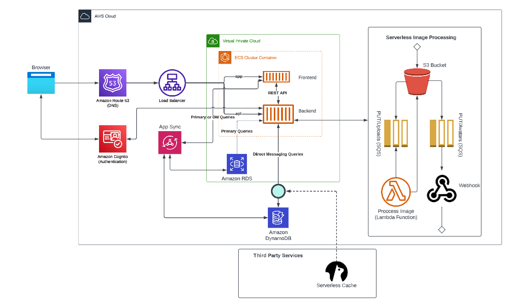
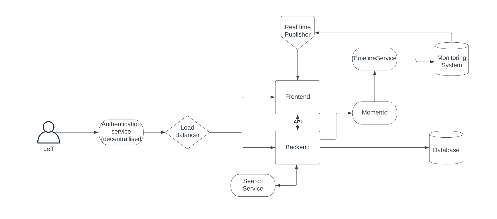

# Week 0 — Billing and Architecture

## Required Homework
### Link to Architectural Diagram on Lucid Charts

https://lucid.app/lucidchart/1e27f448-3dee-4b12-913a-ff5dd3a4fb48/edit?viewport_loc=-912%2C-134%2C4096%2C1724%2C0_0&invitationId=inv_374f71cd-0a11-41d7-9490-deb5722aa0ee

---
### Link to Conceptual Diagram on Lucid

https://lucid.app/lucidchart/1880b560-e920-4f29-a461-d39817fe71f8/edit?viewport_loc=-237%2C-278%2C2048%2C862%2C0_0&invitationId=inv_14dea04d-a2dd-480a-bb38-294c4e2a356f

### Install AWS CLI